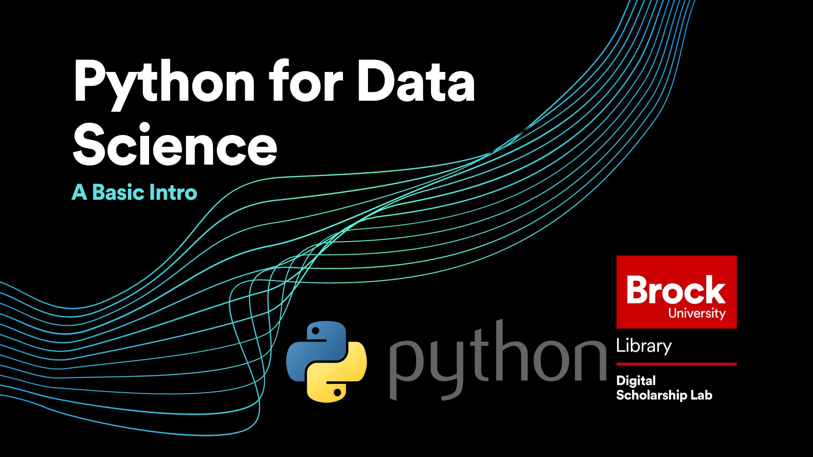

# Python for Data Science

We'll do all of the work for today's tutorial using Juypter Notebooks. 

## Handout

A handout with a description of what is covered in the session can be found  [here](https://brockdsl.github.io/Python_2.0_Workshop/python20.pdf)

## Getting Started

We will be using the Google Collab platform for today's workshop. 

 - Importing Libraries & Working with Data

