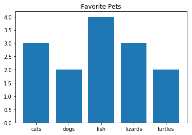

# Advanced Python 

Material for Workshop [http://bit.ly/DSLPython2](http://bit.ly/DSLPython2)

## Importing Libraries

- We like to reuse code as much as possible so we import libraries of functions that are already written
- EG. to Import the statistitcs library: `import statistics`

## Library example: Numpy

- A Python Library that lets you do intensive computation calculations.

Eg. to import Numpy with a shorter name so we don't need to type it out all the time
```
import numpy as np
```

## Library example: Pandas

- A Python Library that lets you manipulate data in an object called a *dataframe*

Eg. to import the library and open a csv file:

```
import pandas as pd
data = pd.read_csv("file.csv")
```

Some useful things to do

- `data.head()` display the first lines of the dataframe
- `data.describe()` a quantitative summary of the data frame
- `data.count()` how many items are in the dataframe
- `data.nunique()` how many unique items are in a dataframe
- `data.unique()` the actual unique values seen in a dataframe 
- `data.value_counts()` the frequency of the unique values found
- `data.groupby()` collects data based on repeating values seen in a column
- `data.sort_values( by = "column name" ascending=True)` sorts dataframe based on a column called "column name"
- `data.mean()` arithmetic mean of dataframe values
- `data.max()` highest value seen in a dataframe
- `data.min()` lowest value seen in a dataframe
- `data.loc["search"]` will locate all items in dataframe that match "search"

## Library Example: Matplotlib

- A Python Library to draw graphs, works will with Pandas and Numpy

Eg. to import Matplotlib into a Jupyter notebook with a shorter name

```
%matplotlib inline
import matplotlib.pyplot as plt
```


Everything you put into a graph object needs to be a list
Example Bargraph:
`plt.bar(["dogs","cats","fish","lizards","turtles"],[2,3,4,3,2])`
`plt.title("Favorite Pets")`
`plt.show()`




